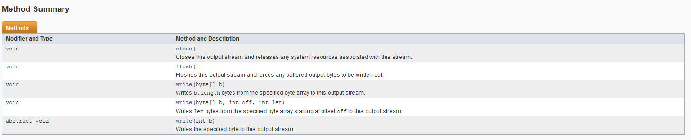

#혼자 공부하는 자바


## 14. 스트림

- 스트림 => 입력 / 출력
- 각각의 스트림 => 바이트기반 / 문자기반

### 14-1 입출력스트림

#### 바이트 출력 스트림: OutputStream


- write(int)는 int형이지만 1byte만 짤라서 출력한다.
	- byte를 짤라 int자리에 넣어도 무방
- 출력 스트림은 바로 출력하지 않고, 내부 버퍼에 우선 저장해놓는다.
- flush()는 출력버퍼에 잔류하는 모든 바이트를 출력한다.

#### 바이트 입력 스트림: InputStream

- 모든 바이트 기반 입력 스트림의 부모


- 입력스트림에서 1byte읽고 int(4byte)로 리턴 -> 4바이트 중 1byte에만 데이터가 들어있다.
- read()는 1바이트씩 읽는다. return형이 int라고 착각하지 말자.
- read(byte []b): 주어진 배열길이*바이트만큼 읽고 배열에 저장. 적으면 거기까지 읽는다. 읽은만큼 리턴 읽은 게 없다면 -1 리턴


#### 문자 출력 스트림 : Writer


- 문자기반 출력 스트림은 Writer에서 상속받아 만든다.
- write는 int형에서 2바이트를 짤라서 사용한다.

#### 문자 입력 스트림 : Reader


- read()를 char형에 형변환시켜서 넣었다가는 -1이 65535가 되어서 -1로는 멈출 수 없게 된다.

### 14-2 보조 스트림

- 다른 스트림에 연결해서 쓰는 스트림
- 자체적으로는 입출력 수행 X => reader, writer, input/outputstream 과 함께씀
- 프로그램은 실제 입/출력스트림은 신경쓰지 않고, 보조스트림을 다루는 느낌으로 사용한다.

#### 보조 스트림 연결하기

- 보조스트림 변수 = new 보조스트림(연결스트림)
- 입출력스트림과 연결된 보조스트림은 합쳐서 새로운 입출력스트림이 된다.
- 보조스트림에 또다른 보조스트림을 이을 수 있다는 말

```java
InputSTream is = System.in;
InputStreamReader reader = new InputStreamReader(is)
BufferedReader br = new BufferedReader(reader);
```

#### 문자 변환 스트림

- 바이트 기반 스트림은 문자를 다루기 불편한 점이 있기에 Reader와 Writer에 연결해 쓰기도 한다.

```java
FileOutputStream fos = new FileOutputStream("C:/temp/test1.txt");
Writer writer = new OutputStreamWriter(fos);
```
```java
FileInputStream fis = new FileInputStream("c:/temp/test1.txt");
Reader reader = new InputStreamReader(fis);
```

#### 성능향상 보조 스트림

- 프로그램의 실행은 연관장치 중 제일 느린 것에 직결된다.(critical path)
- 입출력이 대개 느리기 때문에 버퍼(메모리)를 써 입출력의 횟수를 줄인다.
- 기본적으로 버퍼에 쌓아놓다가 다 차면 출력한다.
- 출력스트림은 기본적으로 작은 버퍼를 가지고 있다. 하지만 더 큰 버퍼를 제공하는 친구들도 있다.
- BufferedInputStream, BufferedOutputStream
- BufferedReader, BufferedWriter
- BufferedReader에는 readLine()이 있다. 편리함.

```java
BufferedOutputStream bos = new BufferedOutputStream(ByteBasedOutputStream);
BufferedWriter bw = new BUfferedWriter(CharacterBasedOutputStream);
BufferedInputStream bis = new BufferedInputStream(ByteBasedInputStream);
BufferedReader br = new BufferedReader(CharacterBasedInputStream);
```

- 연결된 스트림 중 제일 끝에 있는 것만 사용할 수 있는 것은 아니다.
- 연결된 스트림 중 하나가 닫히면 나머지도 못쓰게 된다. IOExcpetion:Stream Closed <br/> os1 - os2 - os3 이런식으로 연결했을 경우, os3을 닫으면 나머지를 연쇄적으로 닫고 os1을 닫으면 os3 - os2를 타다 os1이 닫혀서 못쓰고 이런 식이 아닐까 싶다. 확인하진 못했음.
- 버퍼 스트림들의 경우 출력이 더 큰 폭으로 유의미했으나 입력 역시 충분히 유의미한 수치의 성능향상을 가져왔다. 모조리 메모리에 저장했다 출력하는 출력과 달리 입력은 결국 하드디스크와의 입출력에서 유의미한 횟수차이를 벌리지 못해 큰 성능향상을 못내지 않을까 생각했으나 그렇지 않았다.

> - only non buffer used: 449488900
 - only buffer used: 2880000
 - non buffer input, buffer output: 150116900
 - buffered input, non buffered output: 279717100

#### 기본타입 입출력 보조 스트림

- DataInputStream, DataOutputStream
- primitive 타입을 입출력할 수 있다.
- 입/출력할 때는 같은 형식으로 맞춰야한다.

```java
DataInputSTream dis = new DataInputStream(bytebasedInputStream)
DataOutputStream dos = new DataOutputSTtream(bytebasedOutputStream)
```

- 상당히 직관적으로 작동한다. 끝에 2, 3을 저장한 부분이 각각 32비트씩 차지한 것을 확인할 수 있다.(자바는 int형이 항상 32비트씩 차지한다.)

```java
		write("홍길동", 95.5, 1);
		write("감자바", 90.3, 2);
		os.writeInt(2);
		os.writeInt(3);
		os.flush();
		os.close();
```


- 두개의 인트를 집어넣어 더블형으로 읽을 수 있다.위키의 Double-precision floating-point format에서 1에 해당하는 example을 참조했다.

```java
		
		dos.writeInt(0b00111111111100000000000000000000); //오른쪽 0의 갯수는 20bit이다,왼쪽 1의 개수 10개 / 0의 개수 2개 32비트 
		dos.writeInt(0);  //0 32비트
		
		System.out.println(dis.readDouble());		
		-----
		> 1.0		

```

#### 프린터 보조 스트림

- PrintStream, PrintWriter
- print(), println을 가지고 있는 보조 스트림
- System.out => PrintStream

```java
	PrintStream ps = new PrintStream(BytebasedStream);
	PrintWriter pw = new PrintWriter(CharacterBasedStream);
```

- 프린트 스트림을 쓰더라도 버퍼드 스트림을 같이 쓰면 성능 향상이 미약하게 있는 것 같았다.
- printstream을 쓰지않고 BufferedOutputStream만 쓰면 출력은 더 빠르나 문자열을 그대로 쓸 수 없는 불편함이 있다.(string->byte[]의 시간을 포함하면 별 차이가 없었다.)

```java
	FileOutputStream fos = new FileOutputStream(fp);
	BufferedOutputStream bos = new BufferedOutputStream(fos);
	PrintStream ps = new PrintStream(bos);
```
```
시행	f-b	f-b-p	f-p
1회	792300	1373800	1566200
2회	565400	1046600	985900
3회	766400	877300	948400
4회	676600	878700	1062700
5회	576300	829800	829700
6회	707600	739700	1335200
7회	748800	793300	1397000
8회	555800	1025300	950600
9회	477200	849900	922000
10회	438800	651000	831700
평균	630520	906540	1082940
```
- 위의 표는  bufferedWriter의 경우 미리 string을 byte의 배열로 변환시켜 출력했다. 그냥 쓸때 프린트 스트림을 쓴다고 아주 큰 성능피해는 없을 것으로 기대된다.

#### 객체 입출력 보조 스트림

- ObjectInputStream, ObjectOutputStream
- 바이트 기반 입출력 스트림에 연결해서 쓰면 된다.
- java.io.Serializable인터페이스를 구현한 객체만 직렬화가 가능하다.
- 해당 객체 뿐 아니라 해당 객체의 필드도 모두 직렬화가 가능해야한다. (다만 객체가 배당되지 않은 클래스 변수만 있는 경우는 별 상관없다.)

